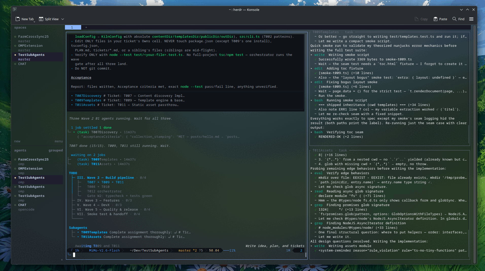

# omp-herdr-panes

Watch your [omp](https://github.com/oh-my-pi) subagents work live, each in its own
[Herdr](https://herdr.dev) pane.

When omp spawns subagents, their work normally happens out of sight: you get a progress line and,
at the end, a result. This extension gives every subagent a **read-only pane** next to your omp
pane that streams its task, thinking, tool calls, and results as they happen. A pane closes by
itself a few seconds after its subagent finishes, and your omp pane goes back to full width.



*omp on the left; two running subagents, each in its own stacked pane on the right.*

## What you get

- **One pane per subagent**, stacked in a single column to the right of omp and titled
  `<name> · <agent>`.
- **Live output**: task prompt, a short preview of the thinking, tool calls with their intent,
  results tagged with their tool name, and errors, updated as the subagent writes its transcript.
  When the subagent ends, a summary line shows its tokens, cost and duration.
- **Nested subagents too**: a subagent that spawns its own subagents gets panes for them as well
  (e.g. `Outer · task` and `Outer.Inner · sonic`).
- **Outcome at a glance**: when a subagent ends, its pane title gets a `✓` (completed) or `✗`
  (failed, aborted) prefix.
- **Automatic cleanup**: a pane closes ~3 s after its subagent completes, ~10 s after it fails;
  quitting omp closes them all, and if omp is killed the panes close by themselves within a second.
- **Stays out of your way**: keyboard focus never leaves the omp pane, and you can keep typing
  while subagents run.
- **No effect outside Herdr**: if omp is not running inside a Herdr pane, the extension does
  nothing at all.

The panes are for watching only. You can't type into a subagent from its pane.

## Requirements

- [omp](https://github.com/oh-my-pi) ≥ 18.3.1
- [Herdr](https://herdr.dev) ≥ 0.9.1
- omp started **inside a Herdr pane** (`echo $HERDR_PANE_ID` prints a pane id)

No other runtime or `npm install` is needed. The pane viewer runs on the Bun runtime embedded in
the `omp` binary.

## Install

1. Clone the repository anywhere, for example:

   ```sh
   git clone https://github.com/bekto/omp-herdr-panes.git ~/omp-herdr-panes
   ```

2. Add that directory to `~/.omp/agent/config.yml`:

   ```yaml
   extensions:
     - ~/omp-herdr-panes
   ```

   If you already have an `extensions:` list, add the line to it.

3. Start omp inside a Herdr pane. That's it.

To try it once without changing your config:

```sh
omp -e ~/omp-herdr-panes/src/index.ts
```

### Let your agent set it up

Paste this prompt into omp (or any coding agent with shell access):

```text
Install the omp extension omp-herdr-panes for me:
1. Clone https://github.com/bekto/omp-herdr-panes.git into ~/omp-herdr-panes
   (if that directory already exists, run `git pull` there instead).
2. Edit ~/.omp/agent/config.yml: if it has an `extensions:` list, add `- ~/omp-herdr-panes`
   to it unless it is already there; if it has none, append
   `extensions:` with that single item. Do not change or reorder any other keys.
3. Show me the resulting config.yml diff.
4. Run `echo $HERDR_PANE_ID` and tell me whether this omp is running inside a Herdr pane.
Then tell me to restart omp inside a Herdr pane to activate the extension.
```

## Usage

Use omp normally. Whenever it runs the task tool (for example "spawn three sonic agents to
check X, Y and Z", or omp decides to delegate on its own), a pane opens for each subagent and
closes after the subagent finishes.

## Configuration

Set these environment variables before starting omp. They are read once, when the extension loads.

| Variable | Default | Meaning |
| --- | --- | --- |
| `OMP_HERDR_PANES` | `1` | `0` turns the extension off |
| `OMP_HERDR_PANES_RATIO` | `0.6` | share of the width kept by the omp pane when the column opens (`0.2`–`0.9`) |
| `OMP_HERDR_PANES_CLOSE_DELAY_MS` | `3000` | how long a pane stays open after its subagent completes |
| `OMP_HERDR_PANES_FAIL_DELAY_MS` | `10000` | how long a pane stays open after its subagent fails or is aborted |
| `OMP_HERDR_PANES_MAX` | `6` | max panes open at once; extra subagents wait for a slot (a finished pane gives up its slot right away) |

An invalid value falls back to that variable's default.

```sh
OMP_HERDR_PANES_MAX=4 OMP_HERDR_PANES_CLOSE_DELAY_MS=10000 omp
```

## Uninstall

- Turn it off for now: start omp with `OMP_HERDR_PANES=0`.
- Remove it: delete its line from the `extensions:` list in `~/.omp/agent/config.yml`, then
  delete the cloned directory. It leaves no state, caches, or background services behind.

## Performance

- The extension adds no model calls or tokens and does not change subagent behaviour. It only reads
  the transcripts omp already writes to disk.
- Opening or closing a pane runs a few short `herdr` CLI commands, one after another, without
  blocking omp. A herdr call that hangs is killed after 5 s.
- Each open pane runs one small viewer process that tails a file, polling every 250 ms while the
  subagent runs and every 2 s after it ended. `OMP_HERDR_PANES_MAX` caps how many run at once.

## How it works

```
omp session ── task:subagent:lifecycle event ──▶ src/index.ts
                                                     │
                                          src/pane-manager.ts (one per omp process)
                                                     │  herdr pane split / rename / run / close
                                                     ▼
                                    Herdr pane: src/viewer.ts <subagent transcript.jsonl>
                                                     └─ tails the JSONL, renders via src/render.ts
```

- The extension listens for omp's `task:subagent:lifecycle` events. `started` opens a pane; any
  other status (completed, failed, aborted) marks the title and schedules the close.
- The first pane is split off the omp pane to the right. Each later pane is split downwards off
  the tallest pane in the column.
- Each pane runs `src/viewer.ts`, which follows the subagent's transcript file and prints each new
  entry. Control and escape sequences in transcript text are stripped, so tool output can't
  restyle or retitle the pane. The viewer exits when the omp process is gone.
- All herdr commands are queued and run one at a time, so subagents started together never race
  each other's splits. Any herdr failure is caught and skipped, so it can't take down your omp
  session.

## Troubleshooting

- **No panes appear**: in the omp pane, check that `echo $HERDR_PANE_ID` prints something and that
  `OMP_HERDR_PANES` is not `0`. Also check that omp picked up the config entry, or use
  `omp -e <path>/src/index.ts`.
- **I closed a pane by hand**: that's fine. The next subagent starts a fresh column.
- **Replay an old transcript** to see what a pane would show:

  ```sh
  BUN_BE_BUN=1 omp src/viewer.ts path/to/Subagent.jsonl --title demo
  ```

## Development

```sh
npm install                 # dev dependencies only: typescript, @types/bun
npx tsc --noEmit            # typecheck
BUN_BE_BUN=1 omp test       # run the tests (bun:test via omp's embedded Bun)
```

| File | Role |
| --- | --- |
| `src/index.ts` | extension entry: wires omp lifecycle events to the pane manager |
| `src/config.ts` | env-var config, lifecycle payload parsing, shell quoting |
| `src/pane-manager.ts` | stacked-pane layout, serialized herdr calls, delayed close |
| `src/herdr.ts` | thin, typed wrapper around the `herdr` CLI |
| `src/viewer.ts` | the program running inside each pane |
| `src/render.ts` | turns transcript entries into terminal lines |
| `src/line-splitter.ts` | UTF-8-safe incremental line splitting |
| `src/omp-types.ts` | the small subset of omp's extension API this project uses |

## License

[MIT](LICENSE)
